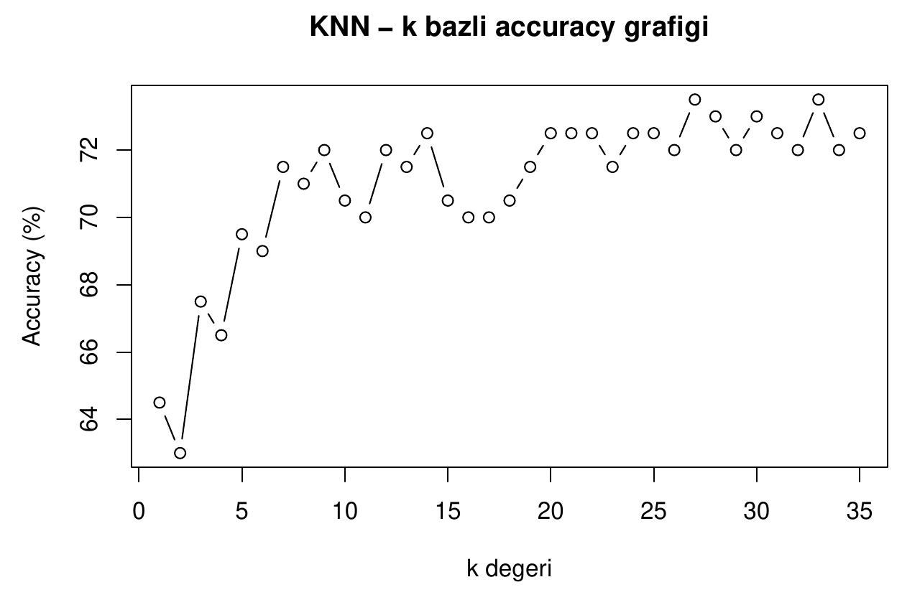
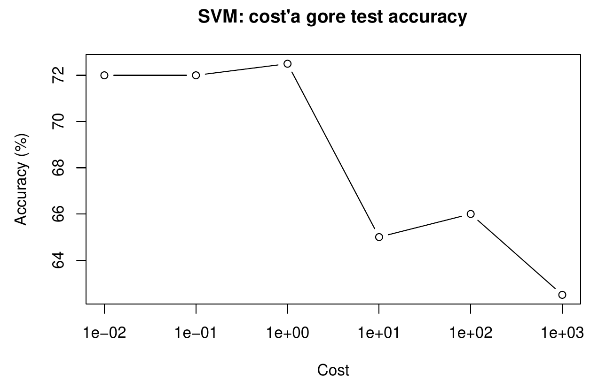

# KNN, Karar Ağacı ve SVM ile Müşteri Satın Alma Tahmini 

Bir müşterinin ürünü satın alıp almayacağını tahmin eden, R ile yazılmış ikili sınıflandırma çalışması. Üç klasik denetimli öğrenme yöntemi karşılaştırılıyor: K En Yakın Komşu (KNN), CART karar ağacı ve radyal çekirdekli Destek Vektör Makinesi (SVM). Çalışmanın ana fikri tek bir doğruluk değerinin peşinden gitmek değil, modelleri çoğunluk sınıfı taban çizgisine karşı dürüstçe karşılaştırmak.

Problem tanımı, metodoloji ve her sonucun yorumunu içeren tam rapor [reports/knn-dt-svm-classification.pdf](reports/knn-dt-svm-classification.pdf) dosyasında. 

## Problem

Müşteri ve ürün bilgilerinden yola çıkarak her müşteri için `Purchase` değişkenini (yes veya no) tahmin etmek.

Veri seti sentetik ve not defterinin içinde sabit bir seed ile üretiliyor, bu yüzden her çalıştırmada aynı 1000 gözlem elde ediliyor. Satın alma olasılığı, değişkenlerin lojistik bir fonksiyonuna rastgele gürültü eklenerek kuruluyor. Yani verideki gerçek sinyal bilinçli olarak zayıf.


| Değişken          | Tür     | Açıklama                               |
| ----------------- | ------- | -------------------------------------- |
| Age               | sayısal | 18 ile 65 arası                        |
| Income            | sayısal | Ortalaması 50.000 civarı, en az 10.000 |
| YearsOfEducation  | sayısal | 8 ile 22 arası                         |
| PreviousPurchases | sayısal | Poisson dağılımı, en fazla 10          |
| DiscountOffered   | ikili   | yes veya no                            |
| FreeDelivery      | ikili   | yes veya no                            |
| ProductPrice      | sayısal | 10 ile 500 arası                       |
| ProductRating     | sayısal | 1 ile 5 arası                          |
| Purchase          | hedef   | yes veya no                            |


Sınıf dağılımı: 729 yes (yüzde 72,9) ve 271 no (yüzde 27,1). Bu dengesizlik yüzünden herkese "yes" diyen bir model bile test setinde yaklaşık yüzde 72 doğruluğa ulaşıyor. Aşağıdaki tüm sonuçlar bu taban çizgisine göre okunmalı.

## Yöntem

1. **Veri üretimi.** Sabit bir seed ile 1000 satır ve 8 değişken üretilir.
2. **Ön işleme.** `DiscountOffered` ve `FreeDelivery` 1 ve 0 olarak kodlanır, `Purchase` faktöre çevrilir.
3. **Bölme.** Yüzde 80 eğitim (800 satır), yüzde 20 test (200 satır). Tekrar üretilebilirlik için seed sabittir.
4. **KNN.** Değişkenler yalnızca eğitim setinin ortalaması ve standart sapması ile standardize edilir, aynı değerler test setine uygulanır. Böylece test verisinden bilgi sızması önlenir. k değerinin 1 ile 35 arasındaki tamamı denenir.
5. **Karar ağacı.** Ölçeklenmemiş veri üzerinde `rpart` ile `maxdepth` değerleri 1, 2, 3, 5, 7 ve 10 için kurulur.
6. **SVM.** `e1071::svm` ile `C-classification` ve radyal çekirdek kullanılır. `cost` değerleri 0,01, 0,1, 1, 10, 100 ve 1000 olarak denenir.
7. **Karşılaştırma.** Her modelin seçilen ayarının test doğruluğu, çoğunluk sınıfı taban çizgisi ile kıyaslanır.


## Sonuçlar

Test setindeki 200 müşteri üzerinde doğruluk:


| Model                         | Seçilen ayar  | Test doğruluğu    |
| ----------------------------- | ------------- | ----------------- |
| Çoğunluk sınıfı taban çizgisi | herkese "yes" | yaklaşık yüzde 72 |
| KNN                           | k = 27        | yüzde 73,5        |
| SVM (radyal)                  | cost = 1      | yüzde 72,5        |
| Karar ağacı                   | maxdepth = 3  | yüzde 72,0        |


### KNN: k değerine göre doğruluk



k = 1 iken doğruluk yüzde 64,5. k büyüdükçe artıyor ve yaklaşık k = 20 sonrasında yüzde 72 ile 73,5 arasında dengeleniyor. En yüksek değer olan yüzde 73,5, k = 27 ve k = 33 için görülüyor. k = 27 seçildi, çünkü ilk zirve noktası ve tek sayı olduğundan iki sınıflı problemde oylamanın berabere kalmasını engelliyor. Çok küçük k değerleri tek tek gözlemlere aşırı uyum sağladığı için belirgin biçimde daha düşük sonuç veriyor.

### Karar ağacı: derinliğe göre doğruluk


| maxdepth | Test doğruluğu |
| -------- | -------------- |
| 1        | yüzde 72,0     |
| 2        | yüzde 72,0     |
| 3        | yüzde 72,0     |
| 5        | yüzde 63,0     |
| 7        | yüzde 61,0     |
| 10       | yüzde 65,0     |


Daha derin ağaçlar eğitim verisindeki gürültüyü ezberliyor ve görülmemiş müşterilerde 7 ile 11 puan kaybediyor. Bu, aşırı uyumun doğrudan göstergesi. Seçilen derinliğe ait ağaç çizimi tek bir kök düğümden oluşuyor ve herkese "yes" tahmini veriyor. Dolayısıyla yüzde 72 sonucu taban çizgisiyle aynı ve ağaç anlamlı bir yapı öğrenmemiş.

### SVM: cost değerine göre doğruluk



Düşük cost değerleri (0,01 ve 0,1) yüzde 72'lik taban çizgisinde kalıyor. cost = 1 yüzde 72,5 ile en iyi sonucu veriyor. Çok yüksek değerler (10 ile 1000 arası) aşırı uyuma gidiyor ve doğruluk yüzde 62,5 ile 66 arasına düşüyor.

Final SVM modelinin test setindeki karışıklık matrisi:


| Tahmin \ Gerçek | no  | yes |
| --------------- | --- | --- |
| no              | 5   | 4   |
| yes             | 51  | 140 |


Model 56 gerçek "no" müşterisinin yalnızca 5 tanesini yakalıyor. Doğruluğunun büyük kısmı çoğunluk sınıfından geliyor.

## Yorum

Üç yöntemin hepsi taban çizgisinin yaklaşık bir buçuk puan çevresinde kalıyor. Sebep verinin kendisi: hedef değişken üretilirken eklenen rastgele gürültü, değişkenler ile satın alma arasındaki ilişkiyi büyük ölçüde maskeliyor, bu yüzden hiçbir model sınıfları iyi ayıramıyor. Taban çizgisini gözle görülür biçimde geçen tek yöntem KNN. Bunun muhtemel nedeni, yerel komşuluk oylamasının diğer iki modelin kaçırdığı bazı "no" müşterilerini yakalayabilmesi.

Projenin pratik dersi şu: dengesiz bir hedef değişkende doğruluk tek başına yanıltıcı. Sonuçları taban çizgisine göre okumak ve karışıklık matrisine bakmak, modellerin gerçekte ne öğrendiğini ortaya koyuyor.

## Sınırlılıklar ve sonraki adımlar

- Hiperparametreler, final doğruluğu raporlayan aynı test seti ile seçildi. Daha sağlıklı bir tasarımda eğitim seti üzerinde çapraz doğrulama yapılır ve test seti en sona saklanır.
- Tek metrik doğruluk. Kesinlik, duyarlılık, F1 ve ROC AUC azınlık sınıfı olan "no" üzerindeki başarıyı çok daha iyi anlatır.
- Tek bir bölme ve 200 satırlık test seti gürültülü. Bir ya da iki puanlık farklar istatistiksel olarak anlamlı sayılmaz.
- Azınlık sınıfı için sınıf ağırlıkları veya yeniden örnekleme denenebilir.


## Depo yapısı

```
.
├── knn-dt-svm-classification.Rmd   Analiz kaynağı (R Markdown)
├── reports/
│   └── knn-dt-svm-classification.pdf   Çıktılar ve yorumlarla hazırlanmış rapor
├── images/
│   ├── knn_k_accuracy.png
│   └── svm_cost_accuracy.png
├── .gitignore
└── README.md
```

## Kullanılan araçlar

R, R Markdown, class (KNN), rpart ve rpart.plot (karar ağacı), e1071 (SVM).